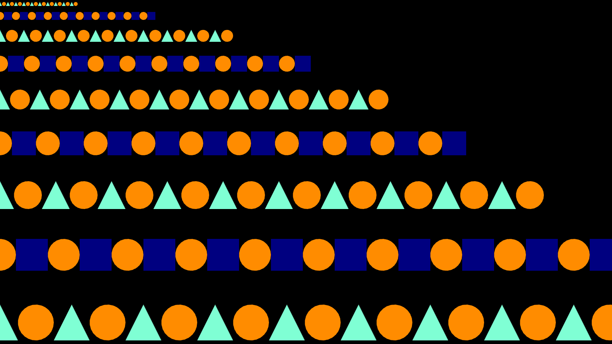
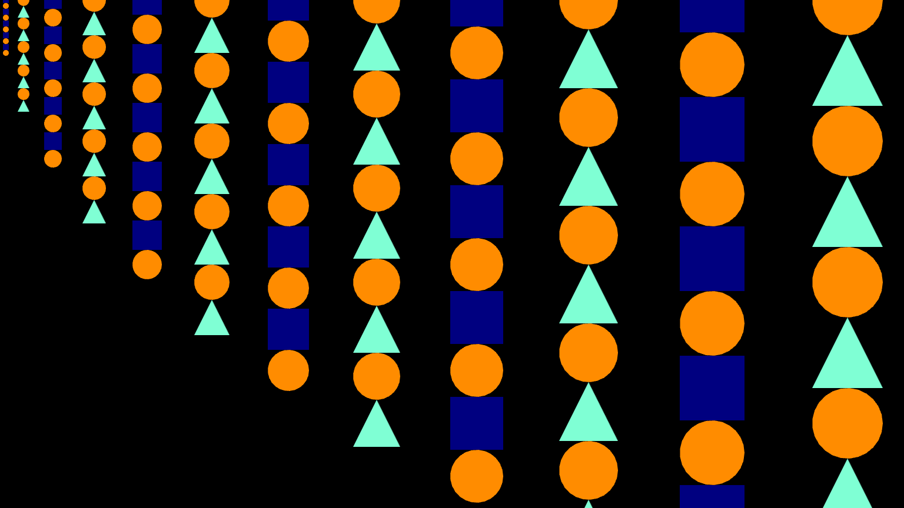
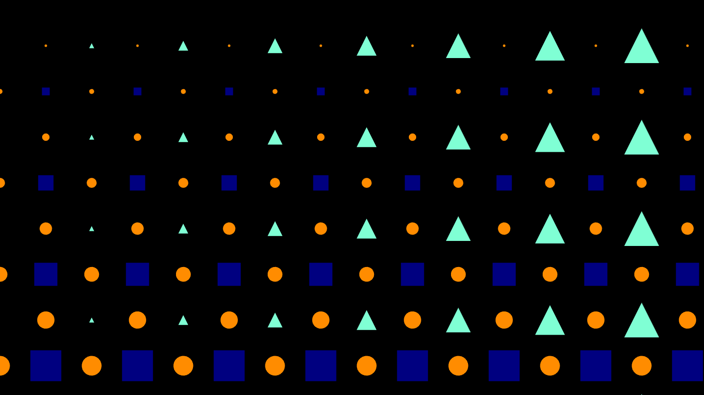

# AltEdu2022 Day17の解説記事

今日のテーマは3色の色、3種類の図形だけを使って、コードを書いてくださいでした。

コードは以下にあります。

[GitHub]()

デモは以下にあります。

[Demo]()

3色の色と3種類の図形（円、矩形、三角形）の3つを使い異なるパターンや変化などをスケッチを3つ作成して描きました。

1つめはy軸に大きさの異なる変化をした図形を描きました。



2つめはx軸に大きさの異なる変化をした図形を描きました。



3つめは3つの図形がそれぞれ異なるタイミングで変化する図形を描きました。




3つめのコードは以下のようになります。

円の変化は
```ts
 circle(p, shapeSize * p.sin(p.frameCount * 0.005) * y * 0.1 );
```

矩形の変化は
```ts
rect(p, shapeSize * p.cos(p.frameCount * 0.005) * y * 0.1 );
```

三角形の変化は
```ts
triangle(p, shapeSize * p.sin(p.frameCount * 0.005) * x * 0.1 );
```

本日は以上です。