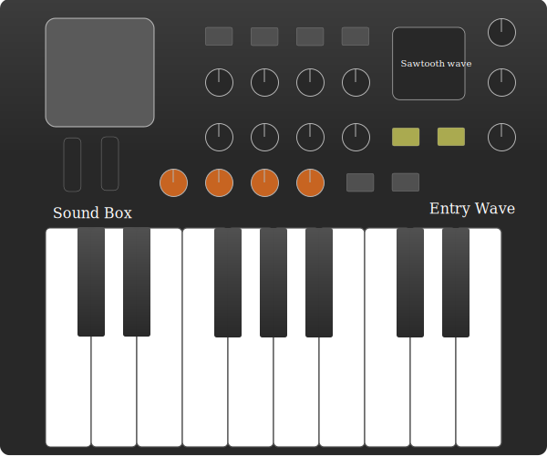

# AltEdu2022 Day18とDay19の解説記事

Day18のテーマは音を使った、あるいは音を感じるようなスケッチを作ってくださいでした。

Day19のテーマはプログラミングを意識して料理を作ってください。作った料理や感想をシェ
アしてくださいでした。

Day18の成果物は以下の通りです。

コードは以下にあります。

[GitHub]()

デモは以下にあります。

[Demo]()

今回はSVGでかんたんなシンセサイザー・キーボードとWeb Audio APIを用いて音の出力そしてWebGL2を使い波形表示を行いました。

シンセサイザー・キーボードはInkscapeを用いて作成しました。エントリーな感じなので基本的にシンプルな作りを意識して作成しました。操作可能領域は白鍵盤と黒鍵盤の2種類のみでツマミなどもありますが今回は実装していません、ただひとこと言いますとCSSクラスを割り当てを行い回転アニメーションを追加すると操作可能になるのではないかと思います。
またオシレーターの波形選択はできませんコンパイルのたび手動で切り替える必要があります🙃これらも後々実装する必要があります。




シンセサイザー・キーボード画像の著作権はHosodaMath / ShingoHosodaにあります。またライセンスはCC-BY-NCです。

今回は課題解決のためにモジュールの動的importなども使われています。

mainのコードはこちらです
```ts
import { createFullScreen, createStartWindow } from "./window/window";
import { loadSVG } from "./load/loadSVG";
import KeyboradData from "./assets/keyboardPlane.svg";
import "sanitize.css";
import "./style.css";
const gameBody = document.body;
const startButton = createStartWindow(gameBody);
createFullScreen(gameBody);
startButton.startButton.addEventListener("click", () => {
  gameBody.removeChild(startButton.startWindow);
  
  // シンセサイザー・キーボードのデーターを読み込み
  loadSVG(KeyboradData).then((svgCode) => {
    const keyBorad = document.querySelector(".keyBoard");
    if (!(keyBorad instanceof HTMLElement)) {
      throw new Error("Error");
    }
    
    //  keyBoradイラストを挿入する
    keyBorad.innerHTML = svgCode;
    
    // HTMLCanvasElementとWebGL2RenderingContextは事前に作成
    const canvas = document.createElement("canvas");
    canvas.width = window.innerWidth;
    canvas.height = window.innerHeight;
    document.body.appendChild(canvas);
  
    const gl = canvas.getContext("webgl2");
    if (!gl) {
      throw new Error("Error!! Does not support WebGL2");
    }

    // ここで動的importしないと例外処理でエラーになる
    // ここが作る上での最大の難所とも言える場所
    import("./sound/audio").then((audio) => {
      let clickedkey: number;

      const oscType: OscillatorType[] = [
        "triangle",
        "sine",
        "sawtooth",
        "square",
      ];
      [...Array(audio.keyData.length).keys()].forEach((count) => {
        audio.keyData[count].element.addEventListener("mousedown", () => {
          audio.KeyboradOscillator.playKey(count, oscType[2], canvas, gl);
          clickedkey = count;
        });
      });

      document.addEventListener("mouseup", () => {
        audio.KeyboradOscillator.stopKey(clickedkey);
      });
    });
  });
});

```

Day19の成果物はこちら

参考文献

Web Audio APIとWebGL2は以下を参考にしました

[How to Code a Playable Synth Keyboard](https://css-tricks.com/how-to-code-a-playable-synth-keyboard/)

[Web Audio APIでマイクから音声を取得してWebGLでビジュアライゼーションする](https://qiita.com/aa_debdeb/items/3e29391d6fbb1c93fd36)

今回はインタラクティブなコンテンツ開発と課題解決能力がかなり身についたと思います。

まだまだ課題は残りますが改善していきたいです。

本日は以上です。